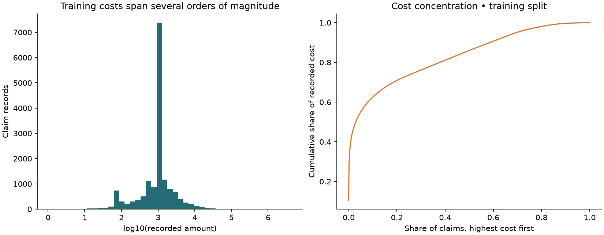

# ClaimScope

**Insurance Claim Cost & Severity Intelligence** — an independent data-science portfolio project built with public data. No affiliation with Allianz; no proprietary data, pricing, underwriting process, or branding is reproduced.

ClaimScope asks whether policy characteristics can estimate the **recorded amount of an existing claim** and identify relatively high-cost claims. The original early/final-cost idea was narrowed because the public source cannot establish first-report feature timing or final settlement maturity.

**Main finding:** limited policy features provide weak predictive signal. Validation selected the constant mean severity baseline; high-cost classification performs modestly above prevalence. This repository demonstrates a reproducible investigation with transparent negative results, not a production insurance decision system.

## Review first

- [Findings and interpretation](docs/findings.md)
- [Generated model comparison](reports/evaluation.md)
- [Dataset feasibility decision](docs/dataset_selection.md)
- [Methodology and leakage register](docs/methodology.md)
- [Code walkthrough and interview questions](docs/review_guide.md)

## Dataset

Original `freMTPL2freq` and `freMTPL2sev` files from [CASdatasets](https://dutangc.github.io/CASdatasets/reference/freMTPL.html), pinned to an immutable repository revision and SHA-256 checksums. This run uses **677,991 policies and 26,444 claim records**, linked by policy ID. A row remains a severity record; amounts are not aggregated into policy-level losses.

The pinned package declares GPL (>= 2). Raw files, joined rows, individual predictions, and trained artifacts are excluded from Git. See the [provenance and usage record](docs/dataset_selection.md) before redistribution. Outcomes are positive recorded amounts in source monetary units; currency and final settlement status are not independently verified.

## Workflow and repository

```text
Pinned source → quality checks → SQLite → SQL join → policy-group split
             → train-only preprocessing → validation selection → held-out evaluation
             → saved pipelines → FastAPI inference
```

```text
data/          Source checksum lock; ignored raw/processed local data
sql/           Modeling join and three analytical queries
src/claimscope Data, modeling, reporting, CLI, and API modules
tests/         Offline fixture-based data/model/API tests
scripts/       Full-data release/reproducibility verification
models/        Ignored locally generated model bundle and metadata
reports/       Metrics, quality reports, explanations, and figures
docs/          Decisions, methods, engineering, status, and review guide
examples/      API request and verified response
.github/       CI checks
```

An EDA notebook is unnecessary: executable modules regenerate the summaries and plots without hidden notebook state. SQLite provides real joins, indexes, count reconciliation, and regional/vehicle-age summaries.

## Reproduce

Tested with **Python 3.12.14**. Run commands from the repository root. The first run needs internet access for dependencies and two public data files (~9.5 MB compressed). Later pipeline runs verify and reuse cached source files.

Windows PowerShell:

```powershell
py -3.12 -m venv .venv
.\.venv\Scripts\python.exe -m pip install -r requirements-lock.txt
.\.venv\Scripts\python.exe -m pip install --no-build-isolation --no-deps -e .
$env:MPLCONFIGDIR = "$PWD\.cache\matplotlib"
.\.venv\Scripts\python.exe -m claimscope.cli run
.\.venv\Scripts\python.exe -m pytest -q
.\.venv\Scripts\python.exe scripts/verify_release.py --rebuild
```

Linux/macOS:

```bash
python3.12 -m venv .venv
.venv/bin/python -m pip install -r requirements-lock.txt
.venv/bin/python -m pip install --no-build-isolation --no-deps -e .
export MPLCONFIGDIR="$PWD/.cache/matplotlib"
.venv/bin/python -m claimscope.cli run
.venv/bin/python -m pytest -q
.venv/bin/python scripts/verify_release.py --rebuild
```

Individual CLI stages are `download`, `prepare`, `train`, and `report`; `run` executes preparation, training, and reporting. `--root PATH` can explicitly select the repository. `prepare` includes downloading only when needed. The package is intended to run from a source checkout because SQL and reports live alongside the code.

On the development machine, the environment and generated artifacts already exist. Start review by opening the reports or running the API command below.

## EDA and statistical findings

Training mean amount is **2,429.18**, versus a median of **1,172.00**. Claims above the training 90th percentile account for **62.5%** of training recorded cost. These differences expose the heavy tail and explain why a typical-cost estimate is not an expected-cost estimate.

No records were quarantined in this source revision. There are 235 repeated policy/amount pairs; they are retained because distinct claims may share amounts. Policy count reconciliation matches retained severity counts. Full details are in [data quality](reports/data_quality.json) and [training EDA](reports/eda.json).



## ML methodology and evaluation

Policies are separated approximately 60/20/20 into training, validation, and test. Identifiers, full-period claim count, exposure, and bonus-malus never enter the predictors. All preprocessing is fitted on training only. No target clipping or temporal generalization claim is made.

Severity candidates: training mean, regularized Gamma GLM, and shallow histogram gradient boosting. Validation Gamma deviance selects the conditional-mean model. A median reference demonstrates the MAE/mean tradeoff but cannot win expected-cost selection.

Classification candidates: prevalence, logistic regression, and shallow histogram gradient boosting. High cost is amount **> 2,806.90**, fixed from the training 90th percentile. Validation average precision selects the classifier. Review capacity is an illustrative 20%, not an approved business workflow.

| Held-out measure | Selected model result |
|---|---:|
| Severity model | Training mean baseline |
| Severity MAE | 2,283.71 source units |
| Severity RMSE | 20,633.55 source units |
| Severity Gamma deviance | 1.6658 |
| High-cost classifier | Histogram gradient boosting |
| Average precision / prevalence baseline | 0.113 / 0.097 |
| ROC-AUC | 0.559 |
| Precision / recall at top 20% | 11.2% / 23.2% |

The selected regressor returns **2,429.18 for every valid input**. That is intentional: a feature model did not beat it on the declared validation criterion. Some challengers look better on test metrics; changing selection after seeing that would invalidate the held-out comparison.

Paired policy-cluster bootstrap intervals, calibration, signed errors, and subgroup diagnostics accompany the [complete evaluation](reports/evaluation.md). This is not evidence of achieved savings or operational readiness.

## Explainability

Validation permutation importance describes each selected model's predictive dependence on the eight original features. Selected severity importance is zero because the winning model is constant. Driver and vehicle age have the largest classification importance in this run. Coefficients for the named Gamma/logistic candidates are exported separately, with standardized-unit and correlation caveats. None of these explanations is causal.

## Prediction API

```powershell
.\.venv\Scripts\python.exe -m uvicorn claimscope.api:app --host 127.0.0.1 --port 8000
```

Open [interactive API documentation](http://127.0.0.1:8000/docs). In another PowerShell terminal:

```powershell
Invoke-RestMethod -Uri http://127.0.0.1:8000/predict -Method Post `
  -ContentType 'application/json' -Body (Get-Content examples/request.json -Raw)
```

`GET /health` verifies readiness; `GET /model` provides model metadata. `POST /predict` validates 1–100 complete records, rejects unknown fields and invalid numeric values, and warns about unknown categories/out-of-range inputs. See [example request](examples/request.json), [verified response](examples/response.json), and [engineering documentation](docs/engineering.md).

The fixed probability cutoff comes from validation. It does not guarantee that 20% of future records will be flagged. Load only trusted locally generated joblib artifacts. Authentication and production hosting are outside this demo.

## Tests and reproducibility

13 tests pass in both the development environment and a fresh installation from the dependency lock, covering data integrity, grouping, leakage barriers, preprocessing, label thresholds, and API behavior. Lint, formatting, and dependency checks pass. A complete rebuild produced byte-identical modeling data, splits, metrics, selections, and predictions in the tested environment. [Verification record](reports/verification.md) and [rebuild hashes](reports/release_verification.json).

```powershell
.\.venv\Scripts\python.exe -m ruff check src tests scripts
.\.venv\Scripts\python.exe -m ruff format --check src tests scripts
.\.venv\Scripts\python.exe -m pip check
```

CI is configured for fixture tests and checks. A remote GitHub run has not been claimed. The installed Starlette test client emits two upstream deprecation warnings; tests still pass.

## Limitations and future work

Historical public motor data is not representative of Allianz Partners or contemporary assistance claims. Missing point-in-time histories and maturity information prevent claims of early final-cost prediction. Extreme losses dominate uncertainty, and policy descriptors omit incident details. Geographic/demographic proxies, model drift, and workflow impact need review before any real application.

Prioritize better timestamps, outcome definitions, and admissible incident features before more models. Then consider chronological validation, uncertainty estimation, and a measured analyst review study. An LLM, Docker, or cloud layer is not required for this result; no text task presently justifies an LLM.
