# Engineering and operational limits

## Architecture

```mermaid
flowchart LR
    A[Pinned public R data files] --> B[Checksum and schema checks]
    B --> C[SQLite policies and claims]
    C --> D[SQL modeling join]
    D --> E[Policy-disjoint split]
    E --> F[Training pipelines]
    F --> G[Validation selection]
    G --> H[Held-out evaluation]
    H --> I[Trusted local model bundle]
    I --> J[FastAPI batch inference]
```

`src/claimscope/data.py` owns download, validation, SQLite, and splitting. `modeling.py` owns preprocessing, candidate training, selection, metrics, and artifact persistence. `reporting.py` creates figures and reports. `api.py` owns request validation and inference only. `cli.py` coordinates the batch workflow.

SQLite fits the dataset and provides visible joins, indexes, and independently readable analytics. It is not advertised as a distributed data platform. Scaling would first mean profiling ingestion, chunking reads, partitioned analytical storage, and appropriate database selection—not adding services automatically.

## API contract

Start from the repository root. `GET /health` returns 200 only with a loaded model; otherwise 503. `GET /model` exposes the feature contract and training metadata. `POST /predict` accepts 1–100 records, requires all eight features, rejects extra fields/negative or nonfinite numeric values, and returns expected recorded amount, high-cost probability, fixed-cutoff flag, and out-of-distribution warnings. Interactive OpenAPI docs are at `/docs`.

Set `CLAIMSCOPE_MODEL` to override the default artifact path. Artifacts use joblib, which can execute code when loaded: load only bundles generated locally or from a trusted source. Runtime scikit-learn must match the artifact metadata. Missing, incompatible, or corrupt models fail readiness rather than return invented predictions. Logs record batch counts and technical failures, not input records.

Artifacts are replaced atomically as individual files, but the entire multi-stage run is not transactional. Stop the API during retraining, check the complete pipeline exit status, and restart it after success. Existing in-memory API models do not hot-reload. Concurrent training runs against the same project directory are unsupported.

## Tests

Unit/integration tests cover ambiguous joins, invalid outcomes, orphan quarantine, policy separation, checksum tampering, prohibited features, fit-only preprocessing, training-only label threshold, model serialization/inference equivalence, unknown inputs, batch limits, and unavailable artifacts. Engineering fixtures are synthetic and are not used to claim model performance. A separate full-data smoke check verifies the generated real-data bundle.

CI runs offline fixture tests, lint, and format checks. It does not download the public dataset on every commit. Full pipeline reproduction is a deliberate integration run. Dependency versions tested locally are pinned in `requirements-lock.txt`; `pyproject.toml` expresses supported ranges. Python 3.12 is the tested interpreter.

## What production would require

- Verified prediction-time snapshots and developed outcomes; chronological backtesting and representative recent data.
- An approved review workflow, service objectives, and measured cost of missed/false flags.
- Authentication, access control, request-size controls at the ingress, secure artifact distribution, and retention rules.
- Monitoring missingness, unknown categories, input ranges, request failures, latency, score distributions, and mature outcome performance.
- Drift investigation before retraining. Input shift alone does not prove performance loss; outcomes arrive with delay.
- A versioned model registry, rollback, controlled releases, and prospective evaluation.

The API is a local portfolio demo. The full checklist above is future work, not a claim that this project is production-ready.
