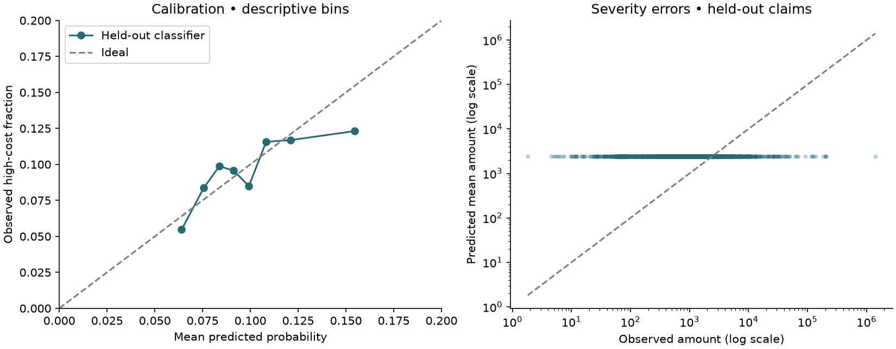

# ClaimScope evaluation

Generated from the complete pinned public dataset. No target capping or test-based model selection.

Selected severity: **mean_baseline**. Selected classifier: **hist_boost_classifier**.

High cost means recorded amount > **2,806.90 source monetary units**, the training 90th percentile.

## Regression

Gamma deviance selects a conditional mean estimator. MAE and RMSE describe different error tradeoffs.

| Split | Model | MAE | RMSE | Gamma deviance | Predicted / observed total |
|---|---|---:|---:|---:|---:|
| validation | mean_baseline | 2,036.30 | 7,672.22 | 1.4518 | 1.286 |
| validation | gamma_glm | 1,976.85 | 7,675.51 | 1.4550 | 1.242 |
| validation | hist_boost_mean | 1,902.93 | 8,016.66 | 1.4689 | 1.161 |
| validation | median_reference_not_mean_estimator | 1,205.27 | 7,686.79 | 1.6630 | 0.620 |
| test | mean_baseline | 2,283.71 | 20,633.55 | 1.6658 | 1.130 |
| test | gamma_glm | 2,221.43 | 20,629.52 | 1.6371 | 1.087 |
| test | hist_boost_mean | 2,116.63 | 20,690.53 | 1.5974 | 1.008 |
| test | median_reference_not_mean_estimator | 1,458.51 | 20,654.83 | 2.1069 | 0.545 |

The median reference targets typical cost, not expected cost; it is ineligible for mean-model selection.

## High-cost classification

| Split | Model | AP | ROC-AUC | Brier | Precision @ 20% | Recall @ 20% |
|---|---|---:|---:|---:|---:|---:|
| validation | prevalence_baseline | 0.094 | 0.500 | 0.085 | 0.091 | 0.192 |
| validation | logistic | 0.119 | 0.553 | 0.085 | 0.125 | 0.265 |
| validation | hist_boost_classifier | 0.125 | 0.562 | 0.085 | 0.122 | 0.259 |
| test | prevalence_baseline | 0.097 | 0.500 | 0.087 | 0.097 | 0.200 |
| test | logistic | 0.113 | 0.550 | 0.087 | 0.130 | 0.269 |
| test | hist_boost_classifier | 0.113 | 0.559 | 0.087 | 0.112 | 0.232 |

AP is average precision, not trapezoidal PR-AUC. Compare against each split's prevalence in metrics.json.

The 20% queue is a hypothetical capacity, not a validated business constraint. Ties are broken with a fixed random seed. A fixed API probability cutoff is chosen from validation and does not guarantee a 20% workload on new data.

## Statistical limits

Policy-cluster bootstrap intervals are in uncertainty.json. They measure test-sample uncertainty conditional on fitted models, not temporal generalization or training variability. Subgroup results with fewer than 30 rows are omitted; remaining groups are descriptive, not fairness certification.

## Explainability

Permutation importance is computed on validation data. Score drops measure predictive dependence, not causation; correlated features can mask each other's importance. Coefficient files describe the explicitly named interpretable candidates, which may differ from selected models. Numerical coefficients use standardized units; all one-hot levels are retained with regularization, so coefficients are not reference-level causal effects.

This retrospective benchmark cannot establish first-report prediction, final settlement accuracy, savings, or suitability for operational decisions.
